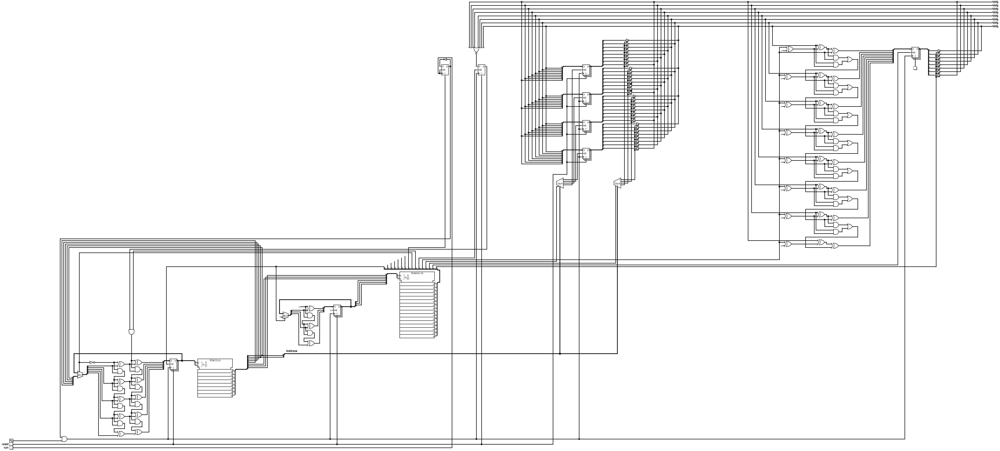

# SWAMY-8

SWAMY-8 is an 8-bit hobby microprocessor designed in logisim. Its a very simple barebones architecture. Its instruction set is from the WDR Papiercomputer and is turing complete.

Specifications and the instruction set can be found in `spec.txt`.

An assembler for the same can be found in the `swasm` directory.

